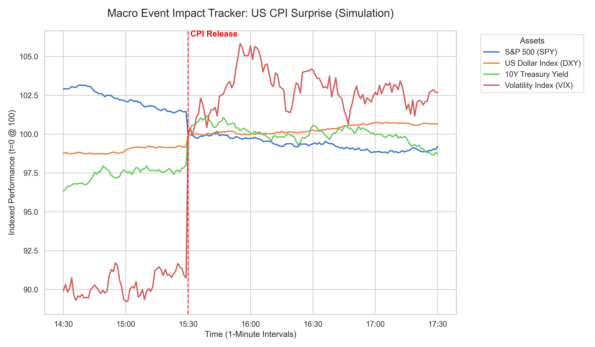

# Macro Event Impact Tracker (High-Frequency Event Study)

## 📊 Overview
This project is a **Quant-focused case study** designed to analyze and visualize the immediate impact of macroeconomic data releases on global financial markets. Specifically, it simulates a **"US CPI Surprise"** scenario, where inflation comes in higher than expected, triggering rapid moves across various asset classes.

The goal is to demonstrate high-frequency data manipulation, normalization techniques, and professional-grade financial visualization using Python.

## 🧠 The Scenario: US CPI Surprise
When US Consumer Price Index (CPI) data exceeds expectations:
- **Equities (SPY):** Generally drop due to fears of higher interest rates.
- **US Dollar (DXY):** Rises as traders price in a more hawkish central bank (Fed).
- **Treasury Yields (US10Y):** Spike as bond prices fall.
- **Volatility (VIX):** Surges due to increased market uncertainty.

## 🛠️ Tech Stack & Methodology
- **Language:** Python
- **Libraries:** Pandas, NumPy, Matplotlib, Seaborn
- **Methodology:** 
    - **Data Simulation:** 1-minute frequency "Mock Data" using random walk with a jump-diffusion shock at $t=0$.
    - **Normalization:** All assets are indexed to **100** at the exact moment of the announcement ($t=0$) to allow direct comparison of percentage moves across different scales.
    - **Event Study:** Analysis of the "Initial Reaction" ($t+15m$) vs. "Intermediate Trend" ($t+60m$).

## 📈 Visualizations
### 1. Multi-Asset Impact Chart
The core output is a professional multi-line chart showing the divergence of asset classes immediately following the release.

### 2. Impact Summary Table
A quantitative look at the net percentage changes:

| Asset | 15-Min Impact (%) | 60-Min Impact (%) |
|-------|-------------------|-------------------|
| SPY   | -0.10             | -0.62             |
| DXY   | +0.13             | +0.26             |
| US10Y | +0.80             | +0.54             |
| VIX   | +2.42             | +4.13             |

## 🚀 How to Run
1. Clone the repository.
2. Ensure you have the required libraries: `pip install pandas matplotlib seaborn numpy`
3. Open the Jupyter Notebook or run the steps sequentially:
    - `step1_mock_data.py` (Generate raw data)
    - `step2_normalization.py` (Process and index data)
    - `step3_visualization.py` (Generate charts)
    - `step4_summary_table.py` (Generate statistics)

---
*Developed for Portfolio Showcase - Quant & Data Science*
